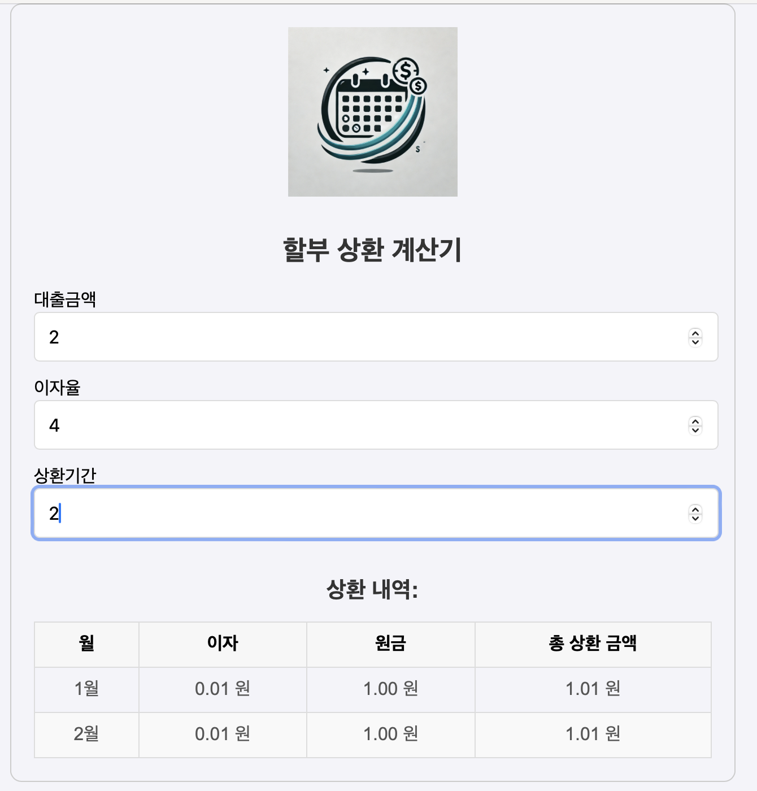

# 할부 상환 계산기

1. 할부상환계산기 프로그램을 만들어 주세요.
2. 계산함수는 `utils/installment`파일에 있습니다.
3. `헤더`,`사용자 Input`,`결과 테이블`을 컴포넌트로 구분해주세요.
4. `결과 테이블`은 `table`로 구현해주세요. (`<table>,<thead>,<tbody>,<tr>,<td>`)
5. 입력 월이 0이하일 경우 `상환기간을 입력해주세요` 라는 메시지를 띄우세요.

