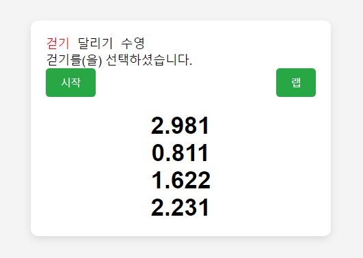

# 실습문제 : 스톱워치 앱 만들기

1. 운동목록이 출력됩니다.
2. 운동을 선택하면 선택된 항목이 빨간색으로 변경되고 `(선택한 운동)를(을) 선택하셨습니다.`라는 메세지가 출력됩니다.
3. 운동을 선택하면 스톱워치가 활성화 됩니다.
4. `시작` 버튼을 누르면 시간이 1초씩 올라갑니다.
5. `랩` 버튼을 누를때마다 기록된 시간이 리스트로 출력됩니다.
6. `중단`버튼을 누르면 스톱워치가 중단됩니다.
7. `시작`버튼을 다시 누르면 리스트가 초기화 되고 재실행 됩니다.

