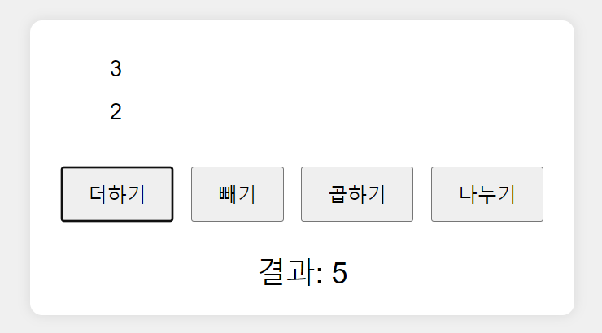

# 실습문제16 간단한 계산기 만들기

## 첫번째

1. 숫자 두개를 입력받습니다. 입력은 prompt함수를 사용합니다.
2. html에 태그를 생성하고 입력받은 두개의 숫자를 화면에 출력합니다.

## 두번째

1. 더하기,빼기,곱하기,나누기 버튼을 만듭니다.
2. 클릭 이벤트를 등록하고 두숫자를 연산하는 함수를 각각 만듭니다.

## 세번째

1. 결과가 화면에 출력됩니다.

