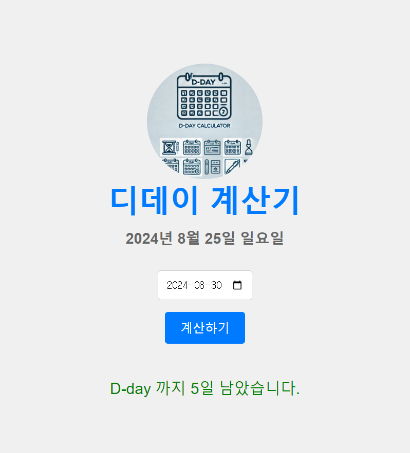

# 실습문제24 : dday계산기 만들기

## 첫번째

1. 사진,제목,현재날짜를 보여주는 UI를 구성합니다.
2. 날짜를 입력받는 input태그를 생성합니다.
3. D-DAY를 계산하는 버튼을 생성합니다.
4. 결과를 알려주는 태그를 생성합니다.

## 두번째

1. 현재날짜를 출력합니다.(2024년 8월 25일 일요일)
2. 버튼에 이벤트를 등록하고 현재날짜와 입력받은 날짜의 차이를 계산하고 출력합니다.

