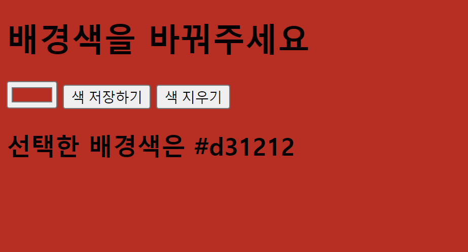
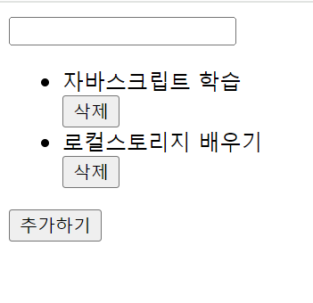

# 실습문제 30

## 1번 원하는 배경색 변경하기

1. `input:color`를 사용하여 원하는 배경색을 지정하세요.
2. 색을 선택후 저장버튼을 누르면 배경색이 변경됩니다.
3. 배경색은 `document.body.style.backgroundColor`를 사용하여 변경합니다.
4. 선택한 색의 헥사코드가 화면에 출력됩니다.
5. 지우기 버튼을 클릭하면 저장된 배경색이 사라집니다.
6. 웹페이지를 실행할때 이벤트를 발생하려면 `addEventListener("DOMContentLoaded",()=>{})`를 사용합니다.

## 간단 TODO list 만들기

1. 할일을 입력받는 `input` 태그와 추가를 하는 버튼을 생성합니다.
2. 버튼을 누르면 입력한 할일이 추가됩니다.
3. 추가된 리스트는 삭제버튼이 있고 삭제버튼을 누르면 할일이 사라집니다.
4. 새로고침해도 할일은 유지 됩니다.

